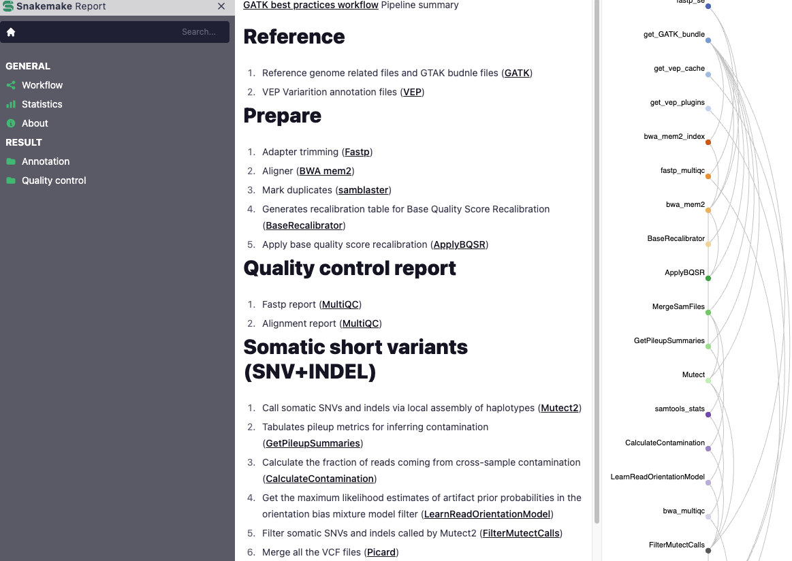
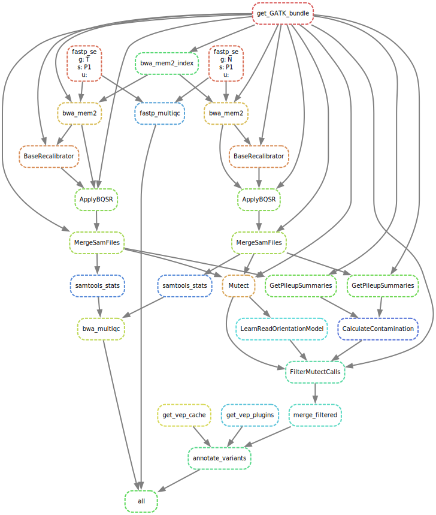

GATK best practices workflow Pipeline summary

SnakeMake workflow for Human Somatic short variants (SNP+INDEL)

### expected fastq inputs

matched normal and tumor samples

### Reference

1. Reference genome related files and GTAK budnle files (GATK)
2. VEP Variarition annotation files (VEP)

### Prepare

1. Adapter trimming (Fastp)
2. Aligner (BWA mem2)
3. Mark duplicates (samblaster)
4. Generates recalibration table for Base Quality Score Recalibration (BaseRecalibrator)
5. Apply base quality score recalibration (ApplyBQSR)

### Quality control report

1. Fastp report (MultiQC)
2. Alignment report (MultiQC)

### Call

1. Call somatic SNVs and indels via local assembly of haplotypes (Mutect2)
2. Tabulates pileup metrics for inferring contamination (GetPileupSummaries)
3. Calculate the fraction of reads coming from cross-sample contamination (CalculateContamination)
4. Get the maximum likelihood estimates of artifact prior probabilities in the orientation bias mixture model filter (LearnReadOrientationModel)
5. Filter somatic SNVs and indels called by Mutect2 (FilterMutectCalls)
6. Merge all the VCF files (Picard)

### Annotation

Annotate variant calls with VEP (VEP)

### SnakeMake Report



### Outputs

```text
├── config
│  ├── captured_regions.bed
│  ├── config.yaml
│  └── samples.tsv
├── dag.svg
├── logs
│  ├── annotate
│  ├── call
│  ├── prepare
│  ├── qc
│  ├── ref
│  └── trim
├── raw
│  ├── P1.N.fastq.gz
│  ├── P1.T.fastq.gz
│  └── SRR24443166.fastq.gz
├── report
│  ├── fastp_multiqc_data
│  ├── fastp_multiqc.html
│  ├── P1.N.fastp.html
│  ├── P1.N.fastp.json
│  ├── P1.T.fastp.html
│  ├── P1.T.fastp.json
│  ├── prepare_multiqc_data
│  ├── prepare_multiqc.html
│  └── vep_report.html
├── results
│  ├── annotated
│  ├── called
│  ├── prepared
│  └── trimmed
└── workflow
    ├── envs
    ├── report
    ├── rules
    ├── schemas
    ├── scripts
    └── Snakefile
```

### Directed Acyclic Graph

